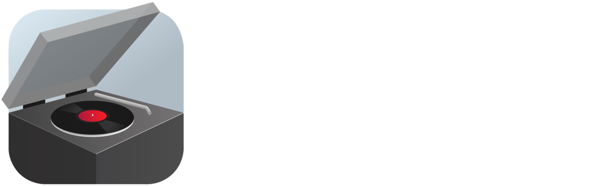

    
     
    A (hopefully good) OSS music player.

> [!WARNING] 
> OpenTurntable is still incredibly early in development, and is not ready for
> production at this time.
> **Use at your own risk!**

## Features
### Current
- Supports .mp3, .flac, .wav, and .ogg playback
- Gathers metadata from files (title, artist, album art, etc)
- Volume control
- Library system to store a collection of music
- Shuffle, repeat/repeat one, previous/next
- Now playing tab that shows you more info about your currently playing song, alongside the next song in your queue

### Planned
- Allowing user to edit song metadata once imported (see issue [#9](https://github.com/TheRandomMelon/OpenTurntable/issues/9))
- Playlist system (see issue [#2](https://github.com/TheRandomMelon/OpenTurntable/issues/2))
- Last.fm scrobbling support (see issue [#4](https://github.com/TheRandomMelon/OpenTurntable/issues/4))
- EQ (equalizer) (see issue [#5](https://github.com/TheRandomMelon/OpenTurntable/issues/5))

## Current Stack
- [Wails](https://wails.io)
- [Nuxt 3](https://nuxt.com)

## Using the Source Code

### C Bindings
Some packages utilized in OpenTurntable require a C compiler such as GCC to be installed and in your environment variables for the app to work.

On Windows, download [MSYS2](https://www.msys2.org), follow the initial installation instructions, and then add `C:\msys64\ucrt64\bin` to your PATH (assuming default install location).

> [!NOTE]
> You also may or not need to run `go env -w CGO_ENABLED=1` to tell Go to enable CGO.

### Live Development
To run in live development mode, run `wails dev` in the project directory.

### Building
To build a redistributable, production mode package, use `wails build -tags "production"`.
